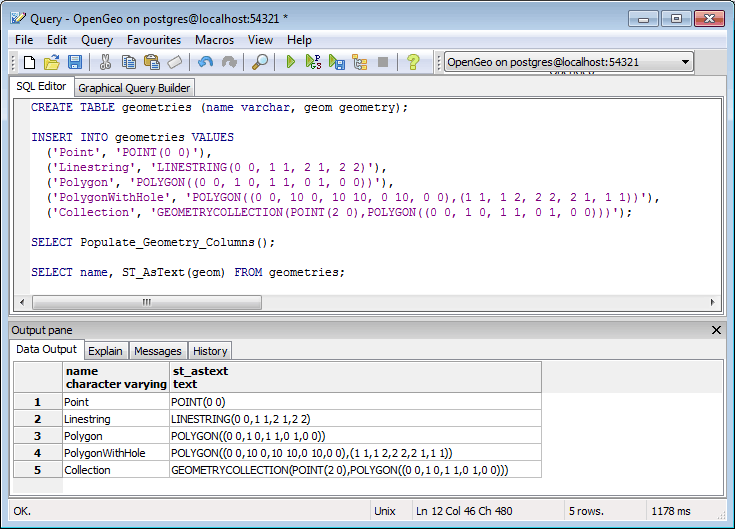

.. _dataadmin.postgis.geometries:

Geometries
==========

Introduction
------------

.. only:: workshop
 
   In the previous :ref:`section <loading_data>`, we loaded a variety of data.  Before we start playing with our data let's have a look at some simpler examples.  

.. only:: usermanual

   PostGIS provides a suite of functions for creating, querying, and manipulating geometries. To illustrate some of those functions, the following sections will describe how to populate a new spatial table and with the data.

Sample table
------------

.. only:: workshop

   In pgAdmin, once again select the **nyc** database.  

Paste the following example SQL code into the pgAdmin SQL Editor window.

.. note::
  Remove any code that may be present in the SQL Editor window before executing the command.

.. code-block:: sql

  CREATE TABLE geometries (name varchar, geom geometry);
  
  INSERT INTO geometries VALUES 
    ('Point', 'POINT(0 0)'),
    ('Linestring', 'LINESTRING(0 0, 1 1, 2 1, 2 2)'),
    ('Polygon', 'POLYGON((0 0, 1 0, 1 1, 0 1, 0 0))'),
    ('PolygonWithHole', 'POLYGON((0 0, 10 0, 10 10, 0 10, 0 0),(1 1, 1 2, 2 2, 2 1, 1 1))'),
    ('Collection', 'GEOMETRYCOLLECTION(POINT(2 0),POLYGON((0 0, 1 0, 1 1, 0 1, 0 0)))');
    
  SELECT Populate_Geometry_Columns();
  
  SELECT name, ST_AsText(geom) FROM geometries;

   *Sample geometries*

The code will CREATE a table (**geometries**) and INSERTs five geometries, a point, a line, a polygon, a polygon with a hole, and a collection. Finally, the inserted rows are SELECTed and displayed in the Output pane.

Representing Real World Objects
-------------------------------

The Simple Features for SQL (``SFSQL``) specification, the original guiding standard for PostGIS development, defines how a real world object is represented. By taking a continuous shape and digitizing it at a fixed resolution we achieve a passable representation of the object.  SFSQL only handled 2-dimensional representations. PostGIS has extended that to include 3- and 4-dimensional representations; more recently the SQL-Multimedia Part 3 (``SQL/MM``) specification has officially defined their own representation.  

.. only:: workshop

 Our example table contains a mixture of different geometry types. We can collect general information about each object using functions that read the geometry metadata.

.. only:: usermanual

 The example table contains a mixture of different geometry types. General information about each object is available using functions that read the geometry metadata. 

 * ``ST_GeometryType(geometry)``—Returns the type of the geometry
 * ``ST_NDims(geometry)``—Returns the number of dimensions of the geometry
 * ``ST_SRID(geometry)``—Returns the spatial reference identifier number of the geometry

.. code-block:: sql

  SELECT name, ST_GeometryType(geom), ST_NDims(geom), ST_SRID(geom)
    FROM geometries;

::

       name       |    st_geometrytype    | st_ndims | st_srid 
 -----------------+-----------------------+----------+---------
  Point           | ST_Point              |        2 |      -1
  Polygon         | ST_Polygon            |        2 |      -1
  PolygonWithHole | ST_Polygon            |        2 |      -1
  Collection      | ST_GeometryCollection |        2 |      -1
  Linestring      | ST_LineString         |        2 |      -1

Points
~~~~~~

   *Different kinds of points*

A spatial **point** represents a single location. This point is represented by a single coordinate (including either 2-, 3- or 4-dimensions). Points are used to represent objects when the exact details, such as shape and size, are not important at the target scale. For example, cities on a map of the world can be described as points, while a map of a single state might represent cities as polygons.  

.. code-block:: sql

  SELECT ST_AsText(geom) 
    FROM geometries
    WHERE name = 'Point';

::

  POINT(0 0)

Some of the specific spatial functions for working with points are:

 * ``ST_X(geometry)`` returns the X ordinate
 * ``ST_Y(geometry)`` returns the Y ordinate

.. only:: workshop

  So, we can read the ordinates from a point like this:

.. only:: usermanual
  
  Use the following example to read the ordinates from a point.

.. code-block:: sql

  SELECT ST_X(geom), ST_Y(geom)
    FROM geometries
    WHERE name = 'Point';

The following SQL query would return the geometry associated with one point (in the ``ST_AsText`` column).

.. code-block:: sql

  SELECT name, ST_AsText(the_geom)
    FROM some_table
    LIMIT 1;

Linestrings
~~~~~~~~~~~

.. figure:: img/geometries_lines.png

   *Different kinds of lines*

A **linestring** is a path between locations.  It takes the form of an ordered series of two or more points. Roads and rivers are typically represented as linestrings. A linestring is said to be **closed** if it starts and ends on the same point. It is said to be **simple** if it does not cross or touch itself (except at its endpoints if it is closed). A linestring can be both **closed** and **simple**. A single real world street may consist of many linestrings, each representing a segment of road with different attributes.

The following SQL query will return the geometry associated with one linestring (in the ``ST_AsText`` column).

.. code-block:: sql

  SELECT ST_AsText(geom) 
    FROM geometries
    WHERE name = 'Linestring';
  
::

  LINESTRING(0 0, 1 1, 2 1, 2 2)

Some of the specific spatial functions for working with linestrings are:

 * ``ST_Length(geometry)`` returns the length of the linestring
 * ``ST_StartPoint(geometry)`` returns the first coordinate as a point
 * ``ST_EndPoint(geometry)`` returns the last coordinate as a point
 * ``ST_NPoints(geometry)`` returns the number of coordinates in the linestring

.. only:: workshop

So, the length of our linestring is:

.. only:: usermanual

The length of the linestring is:

.. code-block:: sql

  SELECT ST_Length(geom) 
    FROM geometries
    WHERE name = 'Linestring';

::

  3.41421356237309

